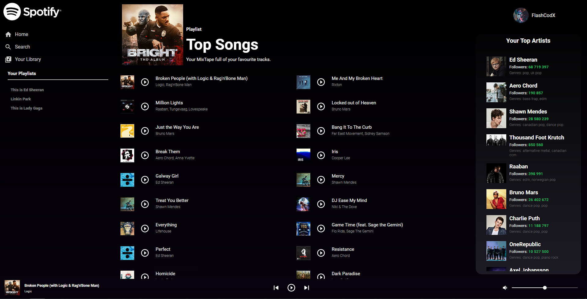

# SPOTIFY


#### This Project is replica of the original Spotify Web App, made with React Js.

> Check out the app:  [https://flashcodx.github.io/Spotify/](https://flashcodx.github.io/Spotify/)



# Features!
  - Has a Demo and a Login Option with the Spotify API.
  - Displays User Playlists, favorite tracks and Artists.
  - Can play a preview of the picked song.
  - Has volume Control, pause and play functionality.
  - Can skip to a position by clicking on the progress bar.


## Tech
* [React] - HTML enhanced for web apps!
* [WebStorm Editor] - awesome web-based text editor made by JetBrains.
* [Spotify API] - Used to gather data for the Application.
* [Material UI Icons] - Used to display Icons on the App.
* [Node.js] - Required by React to work properly.


## Requirements and Installation

AVICII requires [Node.js](https://nodejs.org/)  to run.
Also make sure you have  [GIT](https://git-scm.com/) installed, it makes you life easier.


Clone and install all needed dependencies.

```sh
$ git clone https://github.com/FlashCodX/Spotify
$ cd Spotify
$ npm install
```

Go to the [Spotify DashBoard](https://developer.spotify.com/dashboard/applications) and create a new app.
Copy the client Id from the created app and replace the constant value "clientID" on the spotify.js file.


### Running the App
This will start a local server using node, and should be available on http://localhost:3000/Spotify .
```sh
$ npm start
```

License
----
MIT

**Free Software, Hell Yeah!**

   [React]: <https://reactjs.org/>
   [WebStorm Editor]: <https://www.jetbrains.com/webstorm/r>
   [Spotify API]: <https://developer.spotify.com/>
   [Material UI Icons]: <https://material-ui.com/pt/components/material-icons/>
   [markdown-it]: <https://github.com/markdown-it/markdown-it>
   [Ace Editor]: <http://ace.ajax.org>
   [Node.js]: <http://nodejs.org>
 

  